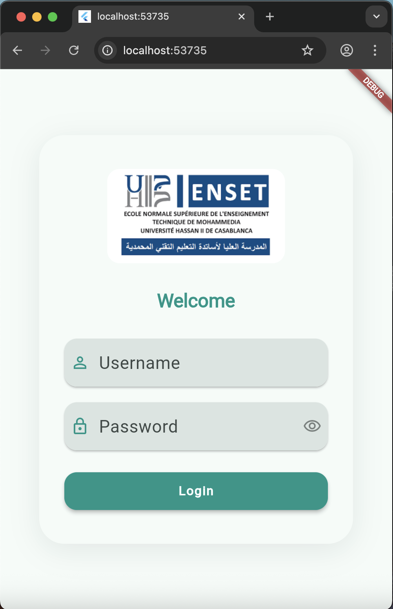
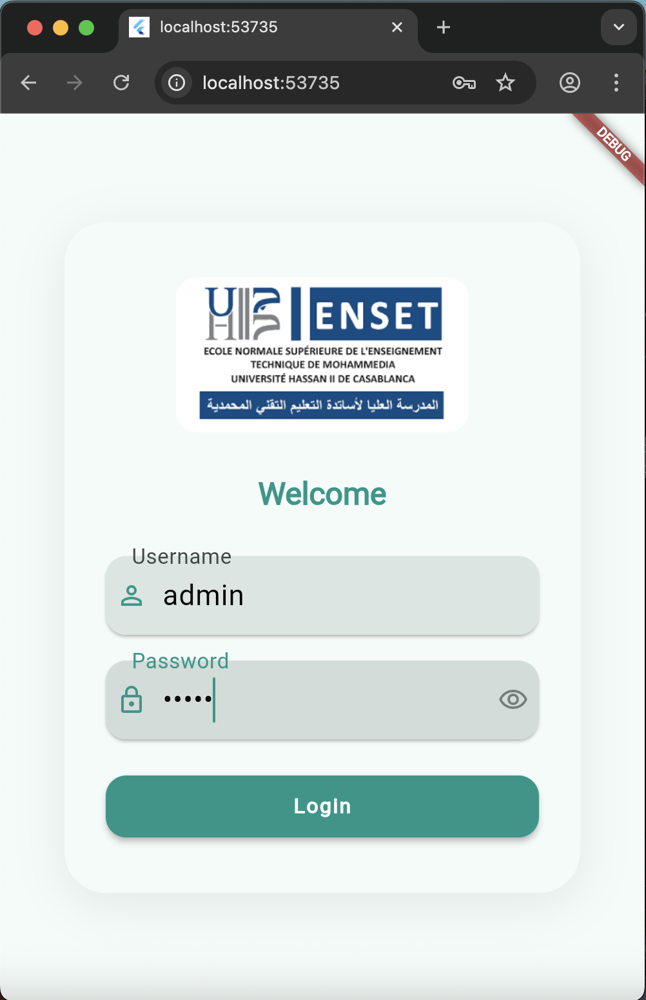

# flutter_chat_app

A simple Flutter chat app with authentication and sidebar navigation.

## Features

- **Login Screen**: Simple login with username and password.  
  - Default credentials:  
    - Username: `admin`  
    - Password: `admin`
  - Only these credentials will allow you to log in; any other username or password will not work.
- **Sidebar Navigation**: Access different screens using a custom sidebar (drawer).
- **Chat Screen**: Chat with an AI assistant (powered by OpenAI API).
- **Loading Indicator**: See a "Thinking..." bubble while the AI is generating a response.
- **User Experience**: Clean UI, easy navigation, and helpful assistant.

## How it works

1. **Login**:  
   When you open the app, you must log in using the default credentials above.  
   If you enter an incorrect username or password, you will not be able to proceed to the app.

2. **Sidebar**:  
   After logging in, you can use the sidebar to navigate between Home and Chat screens.

3. **Chat**:  
   The chat screen lets you talk to the AI.  
   When you send a message, you'll see a "Thinking..." indicator while the AI prepares a response.  
   The AI can answer questions and help you with various topics.

4. **Screenshots**:

   <p align="center">
     
     
   </p>
     
     
     
     
   

## Getting Started

1. **Clone the repo**  
   ```
   git clone https://github.com/youssef-baaziz/chatbot-flutter
   cd flutter_chat_app
   ```

2. **Install dependencies**  
   ```
   flutter pub get
   ```

3. **Run the app**  
   ```
   flutter run
   ```

4. **Login**  
   Use the default credentials (`admin`/`admin`) to log in.  
   Any other username or password will not allow access.

## Notes

- The AI assistant is powered by OpenAI's API.
- You can customize the sidebar and add more screens as needed.
- The app is a great starting point for building your own chat-based applications.

Enjoy chatting! 🚀